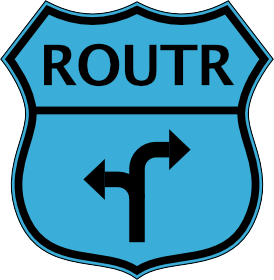

<!-- README.md is generated from README.Rmd. Please edit that file -->

# routr 

<!-- badges: start -->

[](https://www.tidyverse.org/lifecycle/#stable)
[](https://travis-ci.org/thomasp85/routr)
[](https://ci.appveyor.com/project/thomasp85/routr)
[](https://cran.r-project.org/package=routr)
[](https://cran.r-project.org/package=routr)
[](https://codecov.io/github/thomasp85/routr?branch=master)
<!-- badges: end -->

routr is a simple and versatile router for R based web servers. For
people not familiar with back-end development, a router is a piece of
middleware that delegates HTTP requests to the correct handler function.
The delegation is based in the URL of the request and in essence means
that requests directed at */persons/thomas/* ends up in another handler
than */packages/routr/*.

routr is heavily inspired by other routers build for other platforms,
especially those for [Express.js](https://github.com/expressjs) and
[Ruby on Rails](https://github.com/rails/rails), though it doesn’t
mimick either.

## Installation

`routr` is available on CRAN and can be installed in the regular way.

``` r
install.packages('routr')
```

Alternatively you can grab the development version from Github with

``` r
# install.packages('devtools')
devtools::install_github('thomasp85/routr')
```

## Functionality

A router is build up of several seperate routes that are collected in a
route stack. The stack recieves the request and passes it on to the
first route in the stack. Depending on whether the route can handle the
request and whether the handler signals a fall-through, the request is
passed along the stack until a handler signals that no further
processing should be done. This means that it is possible to stack
different functionality like user verification, static ressource
serving, etc. on top of each other.

### The handler

A handler is a function that accepts the arguments `request`,
`response`, `keys`, and `...`. The handler must return a boolean
indicating if the request should be passed down the stack (`TRUE`) or
not (`FALSE`). `routr` uses the
[`reqres`](http://github.com/thomasp85/reqres#reqres) package to provide
powerful request and response classes that makes it easy to work with an
HTTP exchange. An example of a simple handler is:

``` r
h <- function(request, response, keys, ...) {
    response$status <- 200L
    response$type <- 'html'
    response$body <- '<h1>Hello World!</h1>'
    return(FALSE)
}
```

No matter the content of the request passed to this handler it will
return a “Hello World\!” to the client. Because it returns `FALSE` it
block any other handlers below it to modify the response.

### The route

A route is a collection of handlers. For any given request, only one
handler in the route will be called. A route is an object of the R6
Route class and can be created as so:

``` r
route <- Route$new()
route$add_handler('get', '/hello/:what/', h)
```

The first argument to `add_handler` defines the [request
type](https://en.wikipedia.org/wiki/Hypertext_Transfer_Protocol#Request_methods)
while the second defines the path that the handler responds to. The path
need not be static. In the above example the `:what` defines a variable
meaning that the handler will respond to any `/hello/<something>/`
variation. The variable and the value is available to the handler in the
keys argument. For instance, if a request with the URL `/hello/mars/`
were passed through the route, the keys argument passed to the handler
would contain `list(what = 'mars')`. Variables can only span a single
level, meaning that the above handler would not respond to
`/hello/jupiter/saturn/`. To match to anything use `/hello/*` for
responding to any sub-URL to `hello`. Matches to `*` will not end up in
the keys list. If several paths in a route matches a URL the most
specific will be used, meaning that `/*` will match everything but will
always chosen last. With all that in mind lets change the handler to
respond to the `what` variable:

``` r
h <- function(request, response, keys, ...) {
    response$status <- 200L
    response$type <- 'html'
    response$body <- paste0('<h1>Hello ', keys$what, '!</h1>')
    return(FALSE)
}
route$add_handler('get', '/hello/:what/', h)
```

Let’s also add a fallback handler that captures everything:

``` r
hFallback <- function(request, response, keys, ...) {
    response$status <- 200L
    response$type <- 'html'
    response$body <- '<h1>I\'m not saying hello to you</h1>'
    return(FALSE)
}
route$add_handler('get', '/*', hFallback)
```

### The route stack

The route stack manages several routes and takes care of receiving a
request and returning a response. A route stack is an object of the R6
class `RouteStack` and is created like this:

``` r
router <- RouteStack$new()
router$add_route(route, 'test')
```

The order in which routes are added to the stack determines the calling
order, with those added first taking precedence over those added later.
Request are handled by the `dispatch` method like so:

``` r
router$dispatch(request)
```

### Use with fiery

A `RouteStack` is a [fiery](http://github.com/thomasp85/fiery)-compliant
plugin meaning that it can be passed to the `attach()` method of a fiery
server. This will set the server up to pass requests through the route
stack and use the resulting response automatically

``` r
app <- fiery::Fire$new()
app$attach(router)
app$ignite(block = FALSE)
# In Terminal (or visit in browser)
# curl http://127.0.0.1:8080/hello/mars/
# <h1>Hello Mars!</h1>
app$extinguish()
```

By default the router responds to `request` events but can also be used
to dispatch on `header` and `message` events. In the latter case the
request that is send through the handlers is a modified version of the
request used to establish the WebSocket version. If used as a WebSocket
router a way to extract the path to dispatch on must be provided as part
of the `RouteStack` construction.

## Code of Conduct

Please note that the ‘routr’ project is released with a [Contributor
Code of Conduct](https://routr.data-imaginist.com/CODE_OF_CONDUCT.html).
By contributing to this project, you agree to abide by its terms.
